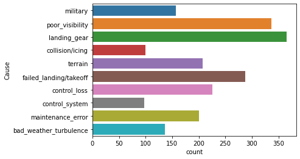
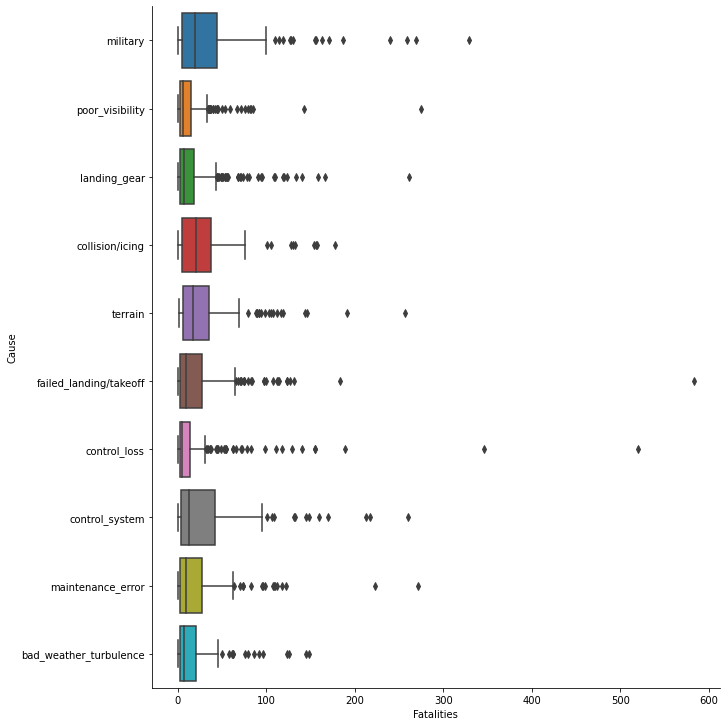

# Introduction
In aviation, it is common to hear that "regulations are written in blood". While proper investigation of airplane crashes and improvements in legislation should be left to the experts, in this project I will explore what we can learn from the data itself, with statistical apprach to natural language.  
The main goals are to:
* find the most common causes of airplane crashes;
* indicate the most and the least fatal types of these accidents.

The analysis is based on Airplane Crashes Dataset [datails avaiable here](https://www.kaggle.com/saurograndi/airplane-crashes-since-1908). Code and more specific comments can be found in [Jupyter Notebook file](airplane_crashes.ipynb) together with the dataset [crashes.csv](crashes.csv).

## Methodology
The study is based on the following fields from the dataset:
* Summary: short text describing what happened during the flight;
* Fatalities: number of people on board who lost ther lives in the accident;
* Aboard: total number of people on board before take-off.

The following steps were taken in order to extract reasonable insights from the data:
1. word tokenizing;
1. keeping only nouns and adjectives;
1. lemmatization;
1. removing custom-build stop words;
1. performing Latent Dirichlet Allocation with different number of topics;
1. human evaluation of inferred topics quality and hand labeling based on words distribution;
1. visualisation of fatality and number of accidents distribution over different types of accidents.

## Results
Assessment of LDA results demonstrated that ~10 is an optimal number of topics. They cover majority of the accidents but are specific enough to make meaningfull conclusions. Causes like bad weather, poor visibility can be compared with more hardware related problems like control system or landing gear. One can also see the significant number of crashes caused by maintenance errors or even military/terrorist activity.  
  
True severity of different types of accidents can be assessed based on Fatality, defined as Fatalities/Aboard. This normalisation allows for reasonable comparison of small plane crashes together with the biggest airliners. The figure below presents distribution of Fatality over different topics. The most deadly and somewhat similar causes are poor visibility and difficult terrain. Majority of these accidents resulted in little to no survivors. On the opposite side of the spectrum there are incidents that happened during landing/takeoff and these connected with landing gear. Their distributions are the most flat, without a strong tendency to high fatality.
  
Final analysis is focused on total number of victims and comparison with the previously detected causes. In terms of total fatalities, difficult terrain remains one of the most lethal factors. However, previously discussed poor visibility seems to be the most dangerous for small aviation, thus high fatality with relatively low total number of victims.  
There is also a third kind of accident emerging, these with not the highest fatalities, but with highest total casualties. Among those there are terrorist attacks and mid-air collisions/icing. This can be explained by terrorists targeting only the biggest plains in order to attract a lot of publicity. Mid-air collisions can include multiple aircraft while explanation for icing would require more in-depth look at principles of flight.
  

## Technical details
This project is run by several key libraries (apart from Data Science abc: pandas, numpy, seaborn etc.):
* spacy: word tokenization, PoS-tagging, lemmatization;
* gensim: implementation of LDA algorithm;
* pyLDAvis: visualization of topics modeled in LDA.
